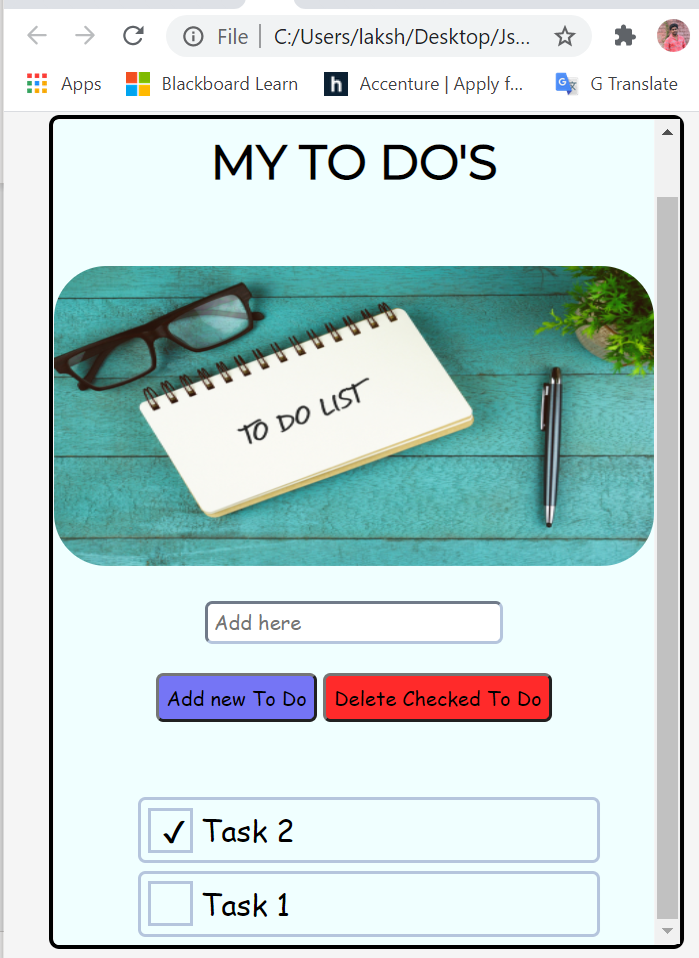

## MyToDoApp   and below is the mockup  of it.
In this myToDO App we are able to `create`, `delete` and `mark as completed` your tasks with help of add and delete buttons provided in the user interface. This is used to keep track of our daily tasks.

